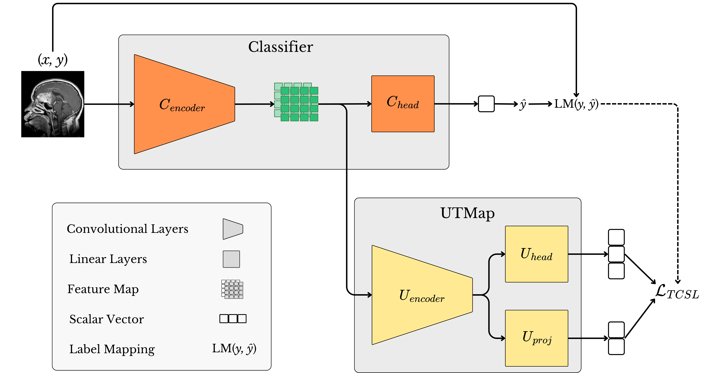
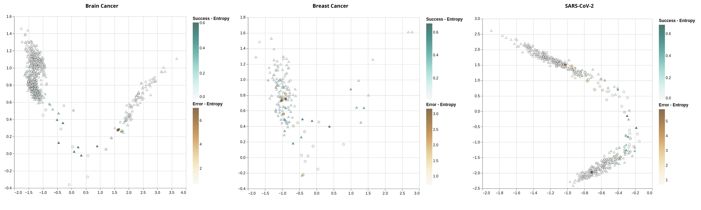

# UTMap: Triplet Neural Network for Uncertainty Medical Image Analysis

[](https://www.python.org/)
[](https://pytorch.org/)
[](https://sol.sbc.org.br/index.php/eniac/article/view/38795)
[](https://doi.org/10.5753/eniac.2025.14372)

UTMap is a meta-learning framework for uncertainty analysis in medical image classification. The method projects image instances into a low-dimensional **Instance Uncertainty Space (IUS)** using a triplet-based neural architecture, enabling visual analysis of classifier behavior and reliability estimation through neighborhood relationships.

> **Research disclaimer:** this repository is intended for academic and experimental use. It is not a medical device and must not be used as a standalone tool for clinical decision-making.

#### Framework
<p align="center">
  
</p>

<p align="center">
  UTMap pipeline, from medical image classification to uncertainty-aware projection and reliability analysis.
</p>

---

## Overview
Deep learning classifiers can achieve strong performance in medical imaging, but their predictions may still be unreliable in high-risk or limited-data scenarios. UTMap addresses this issue by combining:

* **Representation learning** from a CNN classifier, based on ResNet-18 feature maps.
* **Triplet-based meta-learning** to organize instances according to prediction behavior.
* **Instance Uncertainty Space (IUS)**, a 2D projection designed to make regions of confidence and uncertainty easier to inspect.
* **Neighborhood Reliability Score (NRS)**, a reliability score based on the neighborhood structure of the IUS.
* **Failure detection metrics** to compare reliability/uncertainty scores against classifier errors.

The repository includes implementations for training classifiers, training the UTMap projection model, computing reliability scores, evaluating failure detection metrics, and generating plots for analysis.

#### Example of Instance Uncertainty Space Projection

<p align="center">
  
</p>

<p align="center">
  Example of a 2D UTMap projection illustrating how samples are organized in the Instance Uncertainty Space.
</p>

---

## Repository Structure

```text
UTMap/
├── README.md
├── assets/
│   ├── utmap_framework.png
│   └── utmap_projection_example.png
└── src/
    ├── classifiers/      # ResNet-18 classifier and dropout variant
    ├── configs/          # YAML experiment configurations
    ├── datasets/         # Dataset loading and annotation utilities
    ├── losses/           # Triplet-based loss functions
    ├── metrics/          # Classification and failure detection metrics
    ├── plots/            # Visualization helpers
    ├── run/              # Experiment orchestration
    ├── scores/           # Reliability/uncertainty scoring methods
    ├── train/            # Classifier and UTMap training loops
    ├── utils/            # Preprocessing, augmentation, seed, YAML, checkpoints
    └── utmaps/           # UTMap architecture
```

---

## Supported Experiment Configurations

The repository currently provides YAML configuration files for three medical imaging settings:

| Configuration      | Dataset setting                           | File                            |
| ------------------ | ----------------------------------------- | ------------------------------- |
| Brain tumor MRI    | Binary tumor vs. no tumor classification  | `src/configs/brain_tcl.yaml`    |
| Breast ultrasound  | Binary abnormal vs. normal classification | `src/configs/breast_tcl.yaml`   |
| SARS-CoV-2 CT scan | COVID vs. non-COVID classification        | `src/configs/sars_cov_tcl.yaml` |

The dataset helper functions use `kagglehub` to download the corresponding public datasets and generate image paths, labels, and class mappings.

### Datasets

The experiments are designed around public medical imaging datasets available through Kaggle/KaggleHub. The source code currently references the following dataset identifiers:

| Dataset | Task used in this repository | Kaggle/KaggleHub identifier | Classes used | Source |
|---|---|---|---|---|
| Brain Tumor Classification MRI | Binary classification | `sartajbhuvaji/brain-tumor-classification-mri` | `no_tumor` vs. tumor classes grouped as positive | [Dataset link](https://www.kaggle.com/datasets/sartajbhuvaji/brain-tumor-classification-mri) |
| Breast Ultrasound Images Dataset | Binary classification | `aryashah2k/breast-ultrasound-images-dataset` | `normal` vs. `benign`/`malignant` grouped as abnormal | [Dataset link](https://www.kaggle.com/datasets/aryashah2k/breast-ultrasound-images-dataset) |
| SARS-CoV-2 CT-scan Dataset | Binary classification | `plameneduardo/sarscov2-ctscan-dataset` | `non-COVID` vs. `COVID` | [Dataset link](https://www.kaggle.com/datasets/plameneduardo/sarscov2-ctscan-dataset) |

---

## Installation

Clone the repository:

```bash
git clone https://github.com/Rafaelsoz/UTMap.git
cd UTMap
```

Create and activate a virtual environment:

```bash
python -m venv .venv
source .venv/bin/activate      
```

Install the main dependencies:

```bash
pip install numpy scikit-learn torch torchvision tqdm pillow pyyaml kagglehub matplotlib pandas
```
---

## Quick Start

The project is organized as a research codebase rather than a single command-line application. A typical experiment follows this pipeline:

1. Load an experiment configuration from `src/configs/`.
2. Load dataset paths, labels, and class mapping.
3. Define image transformations and augmentations.
4. Train a ResNet-18 classifier.
5. Train UTMap using the classifier feature maps.
6. Project instances into the Instance Uncertainty Space.
7. Compute reliability scores and failure detection metrics.

Example skeleton:

```python
from torchvision import transforms

from src.utils.yaml import open_yaml_file
from src.datasets.brain_tumor import get_brain_mri_tumor_annotations
from src.run.experiment import run_kfold_experiment

# Load configuration without the .yaml extension
configs = open_yaml_file("src/configs/brain_tcl")

# Load dataset annotations
paths, targets, class_to_idx = get_brain_mri_tumor_annotations(
    pre_processing=True,
    target_size=(224, 224),
    image_dir="current_dataset",
    binary_data=True,
)

# Define transformations
transform = transforms.Compose([
    transforms.Resize((224, 224)),
    transforms.ToTensor(),
])

aug_transform = transforms.Compose([
    transforms.Resize((224, 224)),
    transforms.RandomHorizontalFlip(),
    transforms.ToTensor(),
])

# Run k-fold experiment
results = run_kfold_experiment(
    configs=configs,
    paths=paths,
    targets=targets,
    class_to_idx=class_to_idx,
    transform=transform,
    aug_transform=aug_transform,
    n_splits=10,
)
```

For the other datasets, use the corresponding dataset helpers:

```python
from src.datasets.breast_ultrasound import get_breast_ultrasond_annotations
from src.datasets.covid import get_covid_annotations
```

### Method Summary

UTMap learns a projection space from feature maps extracted by a trained image classifier. Instead of only using the classifier output probability, the method analyzes how instances are distributed in a learned uncertainty-oriented representation.

The main idea is:

1. Train a base classifier for the medical imaging task.
2. Extract feature maps from the classifier backbone.
3. Train UTMap with triplet-based supervision to generate a 2D projection.
4. Use the projected space to inspect confidence and uncertainty patterns.
5. Estimate reliability using the Neighborhood Reliability Score.
6. Evaluate whether reliability scores help distinguish correct and incorrect predictions.

---

## Evaluation Metrics

The codebase includes metrics for classification and failure detection, including:

* Accuracy
* Precision
* Recall
* ROC-AUC
* AUPR 
* FPR at 95% TPR

---

## Paper

**UTMap: Triplet Neural Network for Uncertainty Medical Image Analysis**
Rafael Souza e Silva and André C. P. L. F. de Carvalho
Proceedings of the XXII Encontro Nacional de Inteligência Artificial e Computacional (ENIAC 2025), pages 1104–1115.
DOI: `10.5753/eniac.2025.14372`

Paper link: [https://sol.sbc.org.br/index.php/eniac/article/view/38795](https://sol.sbc.org.br/index.php/eniac/article/view/38795)

---

## Citation

If this repository or the UTMap method is useful in your research, please cite the paper:

```bibtex
@inproceedings{souzaesilva2025utmap,
    title={UTMap: Triplet Neural Network for Uncertainty Medical Image Analysis},
    author={Souza e Silva, Rafael and de Carvalho, Andr{\'e} C. P. L. F.},
    booktitle={Anais do XXII Encontro Nacional de Intelig{\^e}ncia Artificial e Computacional},
    pages={1104--1115},
    year={2025},
    doi={10.5753/eniac.2025.14372}
}
```

---

## Additional References

### Dataset References

```bibtex
@misc{sartaj_bhuvaji_ankita_kadam_prajakta_bhumkar_sameer_dedge_swati_kanchan_2020,
    title={Brain Tumor Classification (MRI)},
    url={https://www.kaggle.com/dsv/1183165},
    DOI={10.34740/KAGGLE/DSV/1183165},
    publisher={Kaggle},
    author={Sartaj Bhuvaji and Ankita Kadam and Prajakta Bhumkar and Sameer Dedge and Swati Kanchan},
    year={2020}
}

@article{al2020dataset,
    title={Dataset of breast ultrasound images},
    author={Al-Dhabyani, Walid and Gomaa, Mohammed and Khaled, Hussien and Fahmy, Aly},
    journal={Data in brief},
    volume={28},
    pages={104863},
    year={2020},
    publisher={Elsevier}
}

@article{soaressars,
    title={SARS-CoV-2 CT-scan dataset: A large dataset of real patients CT scans for SARS-CoV-2 identification. medRxiv 2020},
    author={Soares and others},
    journal={Google Scholar}
}

```

---

## Authors

* **Rafael Souza e Silva**
* **André C. P. L. F. de Carvalho**

---

